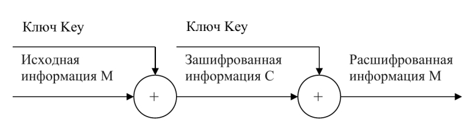
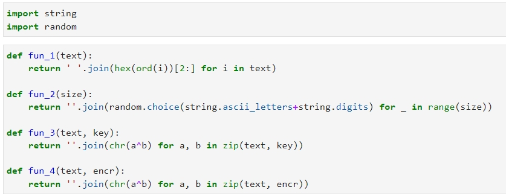
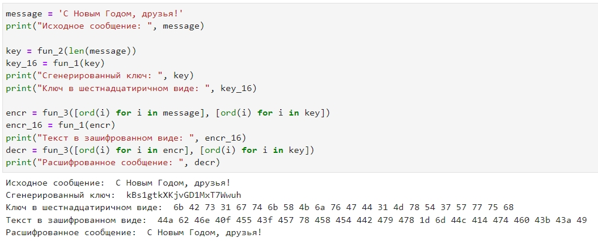
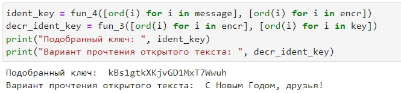

---
# Front matter
lang: ru-RU
title: Защита лабораторной работы №7. Элементы криптографии. Однократное гаммирование 
author: "Бурдина Ксения Павловна"
group: NFIbd-01-19
institute: RUDN University, Moscow, Russian Federation
date: 2022 Oct 19th

# Formatting
toc: false
slide_level: 2
header-includes: 
 - \metroset{progressbar=frametitle,sectionpage=progressbar,numbering=fraction}
 - '\makeatletter'
 - '\beamer@ignorenonframefalse'
 - '\makeatother'
aspectratio: 43
section-titles: true
theme: metropolis

---

# Результат выполнения лабораторной работы №7

# Цель выполнения лабораторной работы 

## Цель выполнения лабораторной работы

Освоение на практике применения режима однократного гаммирования.

# Теоретические сведения

## Теоретические сведения

Гаммирование представляет собой наложение (снятие) на открытые (зашифрованные) данные последовательности элементов других данных, полученной с помощью некоторого криптографического алгоритма, для получения зашифрованных (открытых) данных.

Схема однократного гаммирования:

{width=75%}

## Теоретические сведения

Задача нахождения шифротекста заключается в применении к каждому символу открытого текста следующего правила:

$$C_i = P_i \oplus K_i$$

Задача нахождения ключа решается так, что обе части равенства необходимо сложить по модулю 2 с $P_i$:

$$C_i \oplus P_i = P_i \oplus K_i \oplus P_i = K_i$$

$$K_i = C_i \oplus P_i$$

# Результат выполнения лабораторной работы

## Результат выполнения лабораторной работы

Постановка задачи:

Необходимо подобрать ключ, чтобы получить сообщение «С Новым Годом, друзья!». Требуется разработать приложение, позволяющее шифровать и дешифровать данные в режиме однократного гаммирования.

1. Определить вид шифротекста при известном ключе и известном открытом тексте.
2. Определить ключ, с помощью которого шифротекст может быть преобразован в некоторый фрагмент текста, представляющий собой один из возможных вариантов прочтения открытого текста.

## Результат выполнения лабораторной работы

Ввод импортов и определение функций, которые будем использовать:

{width=90%}

## Результат выполнения лабораторной работы

Листинг и вывод программы для пункта 1:

{width=80%}

## Результат выполнения лабораторной работы

Листинг и вывод программы для пункта 2:

{width=90%}

# Выводы

## Выводы

1. Изучили теорию по теме однократного гаммирования;

2. Реализовали режим однократного гаммирования на практике, написав программу.
